# 🏥 FastAPI Patient Management API

A RESTful Patient Management API built with **FastAPI** to strengthen backend development fundamentals for AI applications.

This project supports CRUD operations, request validation, computed fields, query parameters, sorting, and exception handling using FastAPI and Pydantic.

---

## 📌 Key Features

- ✅ RESTful CRUD API
- ✅ Request validation using Pydantic
- ✅ Computed BMI and Health Verdict
- ✅ Partial Updates (PUT)
- ✅ Query Parameter-based Sorting
- ✅ Interactive Swagger Documentation
- ✅ HTTP Exception Handling

## Main Functions

- Create Patient Records
- View All Patients
- Retrieve Patient by ID
- Update Patient Information
- Delete Patient Records
- Sort Patients by Height, Weight, or BMI
- Automatic BMI Calculation
- Automatic Health Verdict Generation
- Request Validation using Pydantic
- HTTP Exception Handling
- Interactive Swagger Documentation

---

## Tech Stack

- Python
- FastAPI
- Pydantic
- JSON
- Uvicorn

---

## API Endpoints

| Method | Endpoint | Description |
|---------|----------|-------------|
| GET | `/` | Home |
| GET | `/about` | About API |
| GET | `/view` | View all patients |
| GET | `/patient/{patient_id}` | Get patient by ID |
| GET | `/sort` | Sort patients |
| POST | `/create` | Create patient |
| PUT | `/update/{patient_id}` | Update patient |
| DELETE | `/delete/{patient_id}` | Delete patient |

---

## Screenshots

### Swagger Documentation
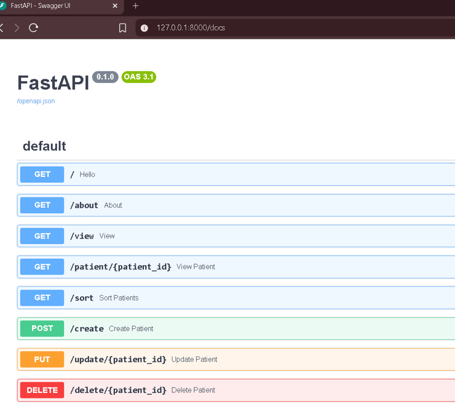

### Create Patient
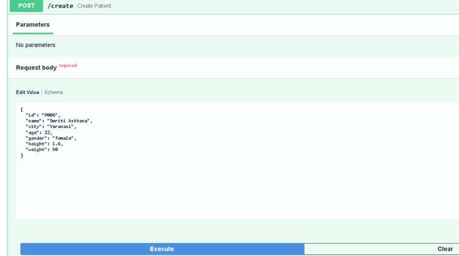

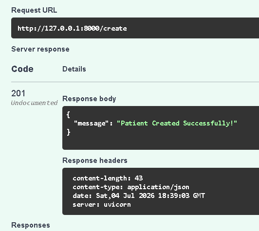

### Retrieve Patient
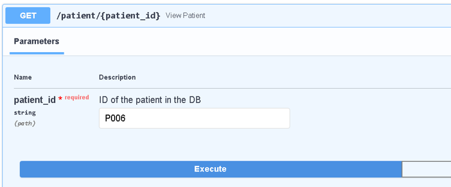

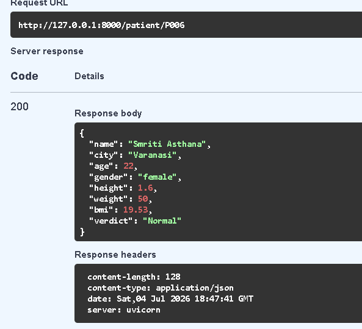

### Update Patient Information
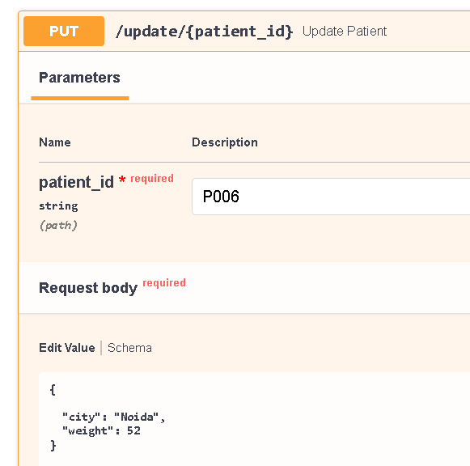

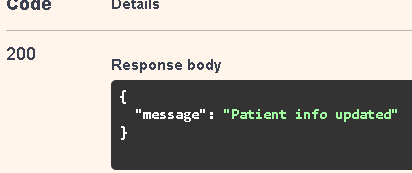

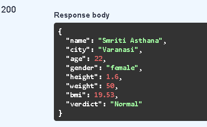

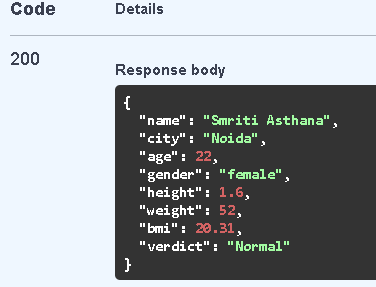

### Sort Patients by BMI
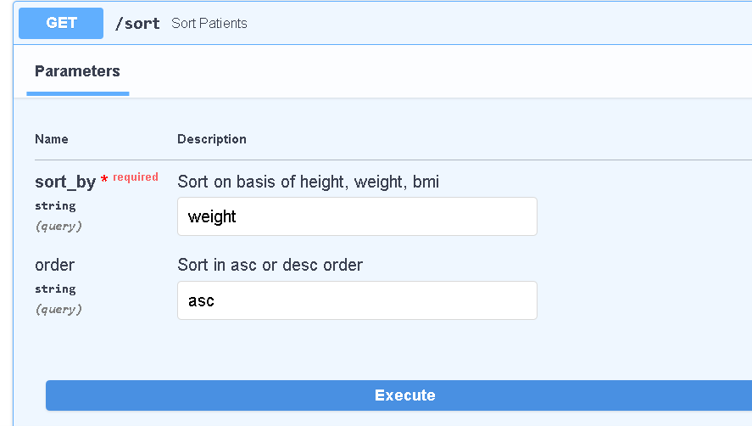

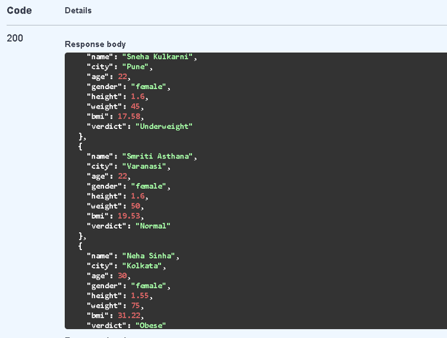

---

## Installation

```bash
git clone https://github.com/yourusername/fastapi-patient-api.git

cd fastapi-patient-api
```

Create a virtual environment

```bash
python -m venv myenv
```

Activate

Windows

```bash
myenv\Scripts\activate
```

Install dependencies

```bash
pip install -r requirements.txt
```

Run

```bash
uvicorn main:app --reload
```

Open

```
http://127.0.0.1:8000/docs
```

---

## Future Improvements

- PostgreSQL Integration
- SQLAlchemy ORM
- JWT Authentication
- Docker
- Modular Project Structure
- Deployment on Render/AWS


